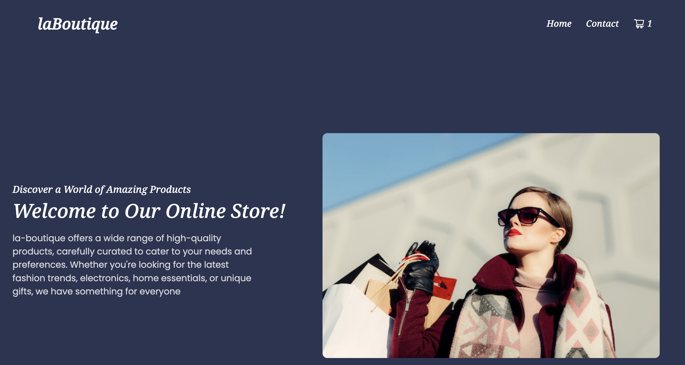

# la-Boutique

## Table Of Content

- [About](#about)
- [Functionalities](#functionalities)
- [Links](#links)
- [Tools](#tools)
- [Contributing](#contributing)
- [License](#license)
- [Developer Bio](#bio)
- [Contact](#contact)

## About

As part of a Noroff assignment, I created la-Boutique, an intuitive, functional, and responsive eCommerce website using React. Users can effortlessly add items to their cart and enjoy flexibility with options to add or remove selected products. The site is styled with Bootstrap and styled components, ensuring a seamless user experience. To enhance data validation, I incorporated a validated contact form utilizing Yup and react-hook-form. This project marked my initiation into React application development, and its implementation presented a valuable learning experience

## Functionalities

The following functionalities are available to the users:

- an user may view a list of products and search products
- an user can view individual product
- an user can view / clear the shopping cart
- an user can add, remove products from the shopping cart
- an user can checkout
- an user can contact using the contact form

## Links

<table>
  <thead>
    <tr>
      <th>Resource</th>
      <td>URL</td>
    </tr>
  </thead>
  <tbody>
    <tr>
      <th>Repository</th>
      <td><a href="https://github.com/sayeda-chattopadhyay/la-boutique">Project Repository</a></td>
    </tr>
    <tr>
      <th>Hosted Demo</th>
      <td><a href="https://la-boutique.netlify.app/">Live Site</a></td>
    </tr>
  </tbody>
</table>

## Tools

- React
- Bootstrap
- JavaScript
- GitHub
- Vscode
- Netlify
- Figma

 

## Setting up

- Download and extract the zip file or clone the project in the command line from your preferred editor.
- Run `npm install` in the project root directory to install the necessary dependencies
- Run `npm run start` to start the development server

## Contributing

Contact if you face any issues and if you want to suggest improvements and changes.

## License

This project is licensed under a Creative Commons license. It is open for contributions, but please credit the project if you use the code in your projects.

## Bio

- UX designer and a front-end developer
- BSc in Physical Sciences
- Several years of experience in banking

<a href="https://endearing-froyo-04825b.netlify.app/">My Portfolio</a>

## Contact

 
